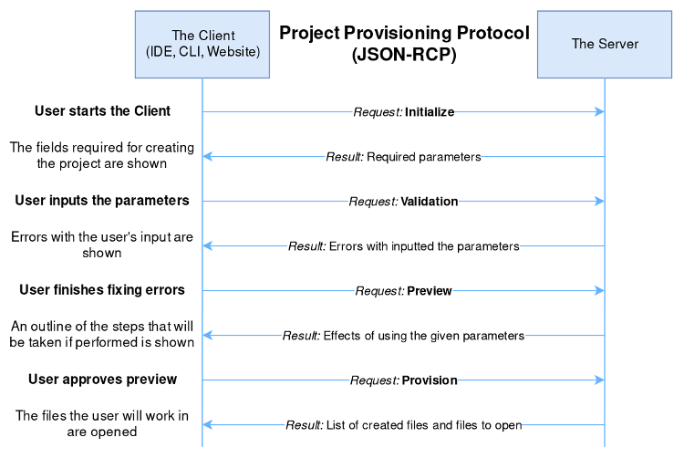

# Project Provisioning Protocol
[Protocol Specifications](protocol.md) | [Implementations](implementations.md)

The Project Provisioning Protocol is used between a project creation tool (the server) and an interface (the client) where a developer wishes to generate a new project. Messages are sent between the client and the server to inform the project creation tool how the user wishes to generate the project, and inform the user what options are available to them. The following diagram illustrates the communications between a tool and an interface through the process of creating a new project.

## Reason For This Protocol
Coders are do-ers, so when they wish to learn a new language or technology jumping into a new project is one of the first things they do. This allows coders to be exposed to simple ideas, syntaxes, and confirms that all the required technologies they will need are properly configured.

However, without a common protocol for creating projects not all technologies offer such a feature to users, leaving them behind in the orientation process of that technology. This is caused by valid reasons. Generating the support for new project creation across multiple interfaces (such as IDEs, web sites, or CLIs) is costly to developers and if they do create project provisioners, it is not ensured that they will be made in such a way that helps new users, also updates to all the different interfaces would be costly, leading to outdated tools only confusing new users more.

With a common protocol for project creation (or provisioning), technology developers only create one provisioning tool and any interface would be able to implement it, and these provisioning tools will be held to a higher standard and as a community we can decided what are the features that will most help with onboarding developers to new technologies.

## Protocol
View the full protocol and the messages that make it up: [Protocol Specifications](protocol.md)

## Implementations
The power of the protocol is shown when multiple servers can be used across multiple clients: [Implementations](implementations.md)

## Contributing
The Project Provisioning Protocol is in its beginning stages, if this project sparks ideas that you think would add value to the project, [create an issue](https://github.com/LucasBullen/Project-Provisioning-Protocol/issues) so we can discuss it.

## License
[Eclipse Public License 2.0](https://www.eclipse.org/org/documents/epl-2.0/EPL-2.0.html)
